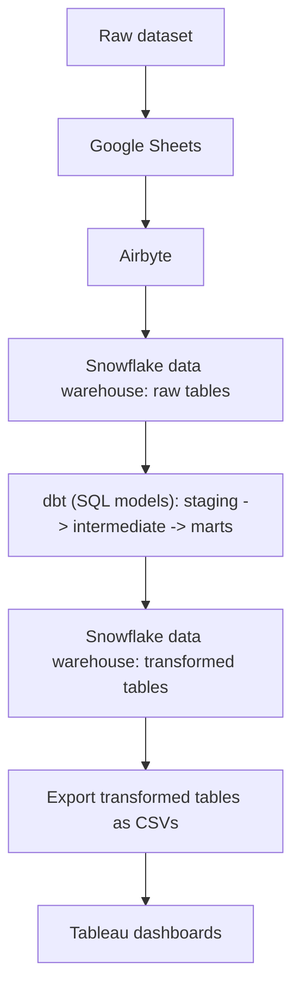

# Electronics Sales & Customer Analytics

An **end-to-end analytics pipeline** for a global **electronics retailer**. I transformed raw 
**sales data** from 2016-2021 across **26K orders** and **12K customers** into actionable insights about **revenue performance, 
top product categories, average order value (AOV), customer lifetime value (CLV/LTV), and 
customer retention cohort analysis**.

### Tech Stack
- Airbyte
- Snowflake Data Warehouse
- dbt
- SQL (Joins, CTEs, Aggregations)
- Python 
- Tableau
- GitHub Projects

### Data Pipeline

### Tableau Public Dashboard
[View Dashboard](https://public.tableau.com/views/electronics_product_analytics/Overview?:language=en-GB&publish=yes&:sid=&:redirect=auth&:display_count=n&:origin=viz_share_link)

### Interesting Insights
- Total **revenue** across 2016–2021 was **\$55.76M** with a **profit** of **$32.66M** (~59% profit margin)
- **November–January** are the **strongest months** likely driven by the **holiday season** in the company's key markets. 
This is followed by a consistent **revenue dip every April** suggesting a post-holiday season slowdown
- Computers and Home Appliances are the top revenue-generating categories
- US stores, online orders, and UK stores are the top revenue-generating locations
- **AOV** is **\$2.12K** and **historical CLV/LTV** is **\$5.47K**, indicating a high-value customer base
- The 2016 and 2017 retention cohorts show higher customer retention in year 2 than year 1. Interesting pattern that 
warrants further investigation

### Recommendations
- Targeted discounts or campaigns in Q2 might offset April revenue dip
- Prioritize the top revenue-generating categories (Computers and Home Appliances) in inventory planning and marketing
- Further expanding online presence could provide access to markets that don't have physical stores

### Future Work
#### With Existing Data
- Dedicated YoY analysis for revenue and profit
- Comparing revenue and order volume between established and new stores
- Customer age group segmentation to identify which age groups drive the most revenue

#### With Additional Data
- Funnel analysis of website traffic, add-to-cart, and final checkout data to identify where potential customers drop off
- Marketing spend data to calculate customer acquisition cost (CAC) and return on ad spend (ROAS)
- Product return and refund data to get a more accurate measure of revenue and profit

### Repo Structure
- **dbt_product_analytics/** - dbt project containing all models, tests, and documentation
- **scripts/** - Python scripts for data cleaning and CSV exports
- **README.md** - project overview

### Data Notes
- All monetary values are in USD
- Revenue and profit are product-level only and cannot be classified as gross or net figures as I don't have
data about the company's overall expenses 
- 2021 data is partial as it only covers January–February. It is included in all visuals but should be interpreted as a partial year
- Customer data had Windows-1252 encoding which corrupted names with special characters, 
converted it to UTF-8 via a Python script before ingestion
- Data source: [Maven Analytics Datasets](https://mavenanalytics.io/data-playground/global-electronics-retailer)